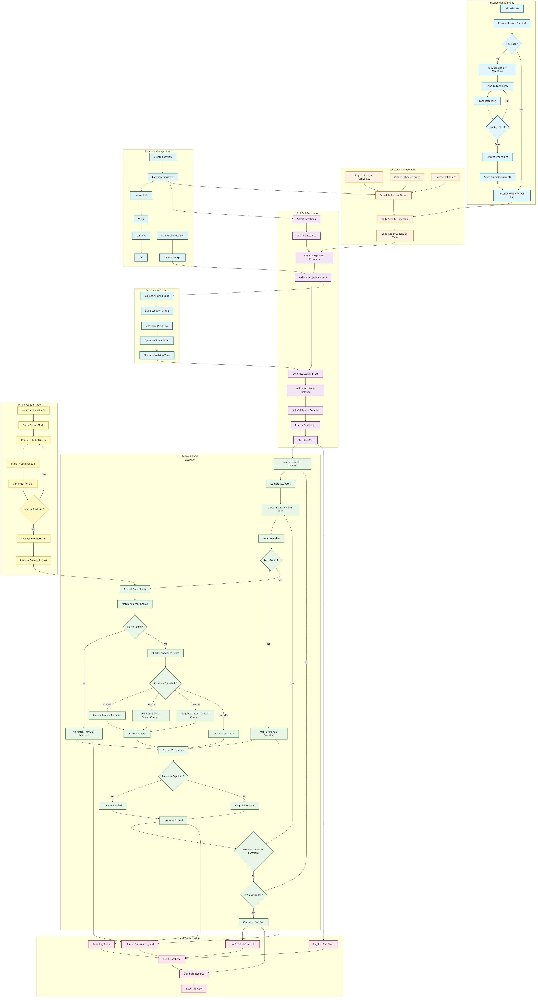
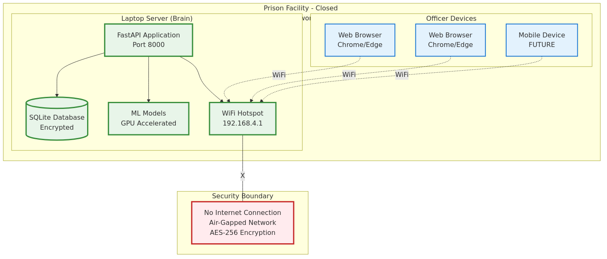
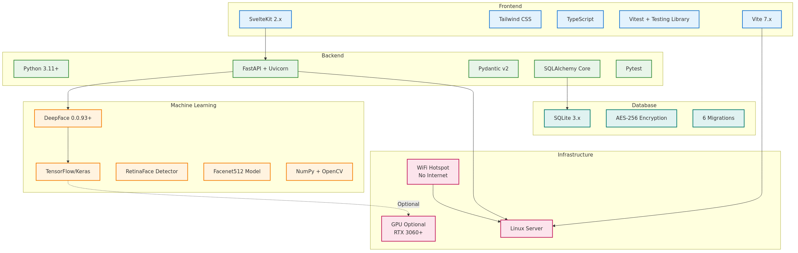

# Prison Roll Call - Rendered Diagrams

All diagrams have been rendered to PNG format for easy viewing.

## 📊 Available Diagrams

### 1. Logical Features Diagram
**File:** `logical-features.png` (542 KB)

Shows all user-facing features and workflows including:
- Prisoner Management & Enrollment
- Schedule Management
- Roll Call Generation
- Active Roll Call Execution with confidence thresholds
- Offline Queue Mode
- Audit & Reporting
- Location Hierarchy
- Pathfinding Service



---

### 2. High-Level Architecture Diagram
**File:** `architecture-highlevel.png` (316 KB)

Shows the complete system architecture:
- Client Layer (Web UI, Future Mobile)
- API Layer (FastAPI + Middleware)
- 9 API Routes
- 7 Business Services
- Machine Learning Pipeline
- 8 Repositories
- Database (9 tables)
- Network Layer


---

### 3. Deployment Architecture Diagram
**File:** `deployment-architecture.png` (80 KB)

Shows the physical deployment topology:
- Laptop Server (Brain) with FastAPI, SQLite, ML Models
- WiFi Hotspot (Closed Network)
- Officer Devices (Web Browsers)
- Security Boundary (Air-Gapped)



---

### 4. Technology Stack Diagram
**File:** `technology-stack.png` (98 KB)

Shows all technologies used:
- **Frontend:** SvelteKit, Tailwind, TypeScript, Vitest, Vite
- **Backend:** Python, FastAPI, Pydantic, SQLAlchemy, Pytest
- **ML:** DeepFace, TensorFlow, RetinaFace, Facenet512
- **Database:** SQLite + AES-256
- **Infrastructure:** Linux, WiFi Hotspot, Optional GPU



---

## 🎨 Diagram Features

### Color Coding

**Logical Features:**
- 🔵 Blue = Enrollment workflow
- 🟢 Green = Verification workflow
- 🟠 Orange = Schedule management
- 🟣 Purple = Roll call generation
- 🔴 Pink = Audit logging
- 🟢 Teal = Location hierarchy
- 🟡 Yellow = Offline queue

**Architecture:**
- 🔵 Light Blue = Client layer
- 🟣 Purple = API layer
- 🟢 Green = Service layer
- 🟠 Orange = ML pipeline
- 🔴 Pink = Data access layer
- 🟢 Teal = Database layer
- 🟡 Yellow = Network layer

### Image Specifications

All diagrams rendered with:
- **Format:** PNG with transparent background
- **Logical Features:** 3200x2400px (high detail)
- **Architecture:** 3200x2800px (high detail)
- **Deployment:** 2400x1600px (medium)
- **Tech Stack:** 2400x1800px (medium)

---

## 📁 Files in This Directory

```
docs/diagrams/
├── README.md                      # Viewing guide with Mermaid source
├── DIAGRAMS.md                    # This file (rendered diagram showcase)
├── logical-features.md            # Mermaid source for features
├── system-architecture.md         # Mermaid source for architecture
├── logical-features.png           # ✅ Rendered diagram
├── architecture-highlevel.png     # ✅ Rendered diagram
├── deployment-architecture.png    # ✅ Rendered diagram
└── technology-stack.png           # ✅ Rendered diagram
```

---

## 💡 Usage Tips

### For Presentations
- Use `logical-features.png` for stakeholder demos
- Use `architecture-highlevel.png` for technical reviews
- Use `deployment-architecture.png` for infrastructure planning
- Use `technology-stack.png` for developer onboarding

### For Documentation
- Embed in README files
- Include in technical specifications
- Use in training materials
- Reference in architecture decision records

### For Editing
- Edit the `.md` files with Mermaid source code
- Re-render using: `mmdc -i <source>.mmd -o <output>.png`
- Or use the mermaid.live editor for quick changes

---

## 🔄 Regenerating Diagrams

If you need to update the diagrams:

1. **Edit the source** in `logical-features.md` or `system-architecture.md`
2. **Extract the Mermaid code** (between ` ```mermaid` and ` ``` `)
3. **Save to temp file** with `.mmd` extension
4. **Render with mmdc:**
   ```bash
   mmdc -i input.mmd -o output.png -w 3200 -H 2400 -b transparent
   ```

Or use the provided script:
```bash
npm install -g @mermaid-js/mermaid-cli
cd docs/diagrams
# Then run mmdc commands as needed
```

---

## 📊 System Statistics

**Diagrams Show:**
- 11 web UI pages
- 28 API endpoints
- 7 business services
- 3 ML components
- 8 repositories
- 9 database tables
- 6 database migrations
- 141 web UI tests
- 488 server tests

**Total Test Coverage:** 629 tests ✅

---

**Generated:** January 30, 2026
**Tool:** Mermaid CLI v10
**Status:** ✅ All diagrams rendered successfully
