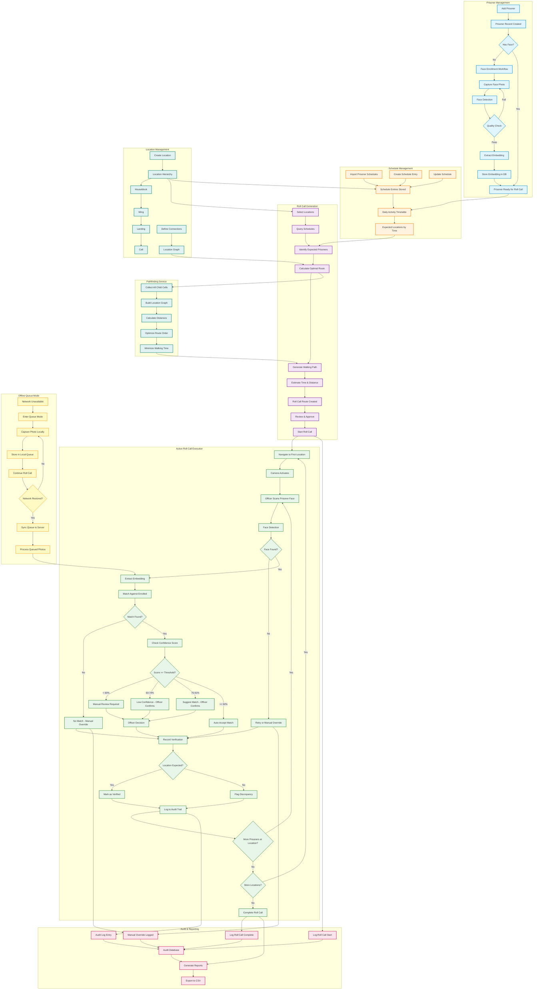

# Prison Roll Call - Logical Features Diagram

This diagram shows all the logical features of the Prison Roll Call system and how they interact with each other.

## Feature Interactions Summary

### Core Workflows

1. **Prisoner Enrollment**
   - Add prisoner → Capture face → Detect face → Quality check → Extract embedding → Store
   - Prerequisites: Good lighting, single face, no obstructions
   - Output: 512-dimensional face embedding in database

2. **Schedule Management**
   - Import/create schedules → Store activity timetables → Query expected locations
   - Supports: Recurring activities, one-off appointments, multiple activity types
   - Output: Expected prisoner locations by time

3. **Roll Call Generation**
   - Select locations → Query schedules → Calculate route → Generate walking path
   - Features: Multi-location support, optimal routing, time estimation
   - Output: Ordered route with expected prisoners at each stop

4. **Active Roll Call Execution**
   - Navigate route → Scan faces → Verify identity → Record results
   - Confidence thresholds: <60% (manual), 60-74% (review), 75-91% (confirm), ≥92% (auto-accept)
   - Output: Verification records with confidence scores

5. **Offline Queue Mode**
   - Network lost → Queue photos locally → Sync when restored
   - Limits: 50 photos, 500MB storage, 4-hour expiry
   - Output: Queued verifications processed on reconnection

6. **Audit & Reporting**
   - Log all actions → Track manual overrides → Generate reports
   - Captures: Who, what, when, where, why
   - Output: Tamper-proof audit trail, CSV exports

### Key Decision Points

- **Quality Check (A8):** Rejects poor quality images (blur, low light, occlusion)
- **Match Found (V9):** Determines if face matches enrolled prisoner
- **Confidence Threshold (V12):** Decides level of officer involvement
- **Location Expected (V19):** Flags prisoners in wrong locations
- **Network Status (Q6):** Switches between online and offline modes

### Integration Points

- **Schedules → Roll Call Generation:** Expected locations inform route planning
- **Enrollment → Verification:** Stored embeddings enable face matching
- **Location Hierarchy → Pathfinding:** Graph structure enables route optimization
- **Verifications → Audit:** All actions logged for compliance
- **Queue → Verification:** Offline photos processed same as live scans
