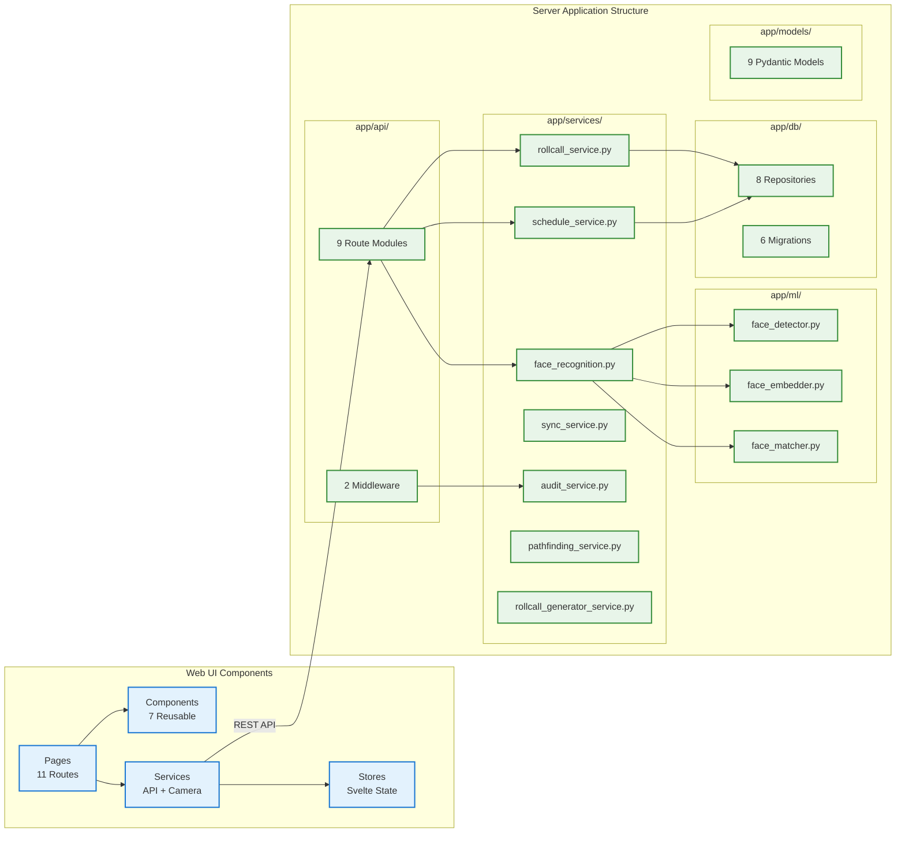
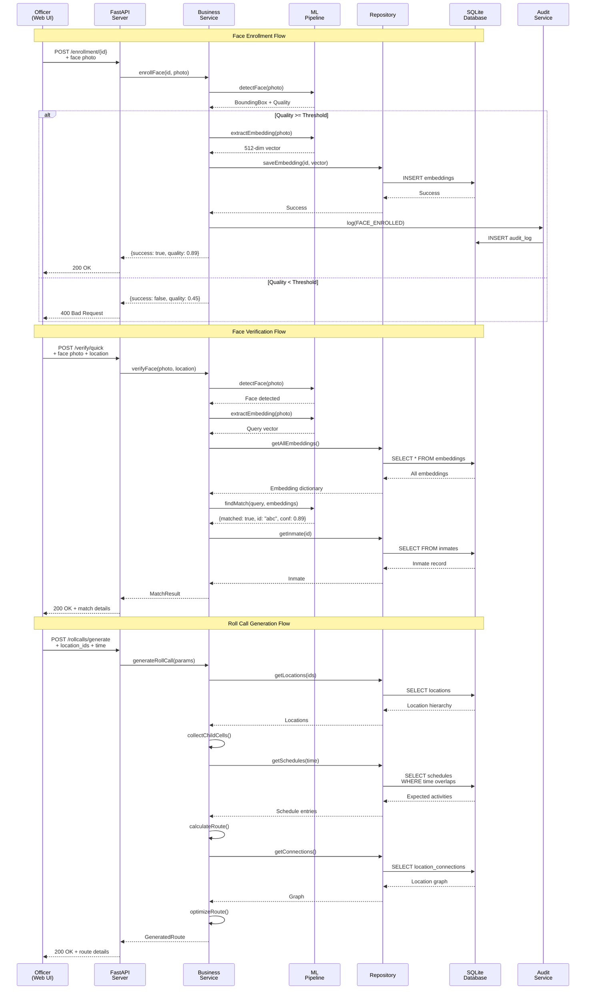
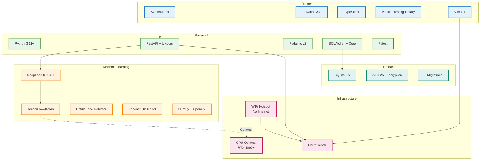
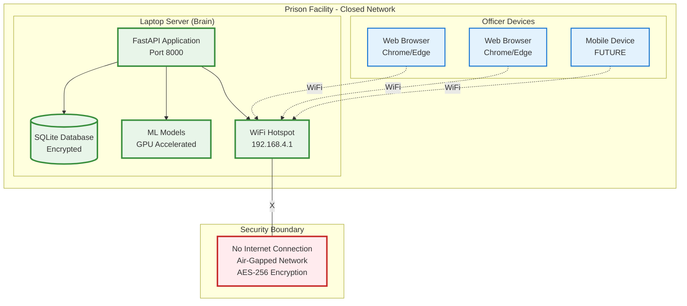

# Prison Roll Call - System Architecture Diagram

This diagram shows the technical architecture of the Prison Roll Call system.

## High-Level Architecture

```mermaid
graph TB
    %% Clients
    subgraph "Client Layer"
        WEB[Web UI<br/>SvelteKit]
        MOB[Mobile App<br/>React Native<br/>FUTURE]
    end

    %% API Gateway
    subgraph "API Layer"
        API[FastAPI Server<br/>Port 8000]
        CORS[CORS Middleware]
        CTX[Request Context<br/>Middleware]

        API --> CORS
        CORS --> CTX
    end

    %% Routes
    subgraph "API Routes"
        R_HEALTH[/health]
        R_INMATES[/inmates]
        R_LOCATIONS[/locations]
        R_ENROLL[/enrollment]
        R_VERIFY[/verify]
        R_ROLLCALL[/rollcalls]
        R_SCHEDULE[/schedules]
        R_SYNC[/sync]
        R_VERIF[/verifications]
    end

    %% Services Layer
    subgraph "Business Logic Layer"
        S_FACE[Face Recognition<br/>Service]
        S_ROLLCALL[Roll Call<br/>Service]
        S_SCHEDULE[Schedule<br/>Service]
        S_SYNC[Sync<br/>Service]
        S_AUDIT[Audit<br/>Service]
        S_PATH[Pathfinding<br/>Service]
        S_GEN[Roll Call Generator<br/>Service]
    end

    %% ML Layer
    subgraph "Machine Learning Pipeline"
        ML_DETECT[Face Detector<br/>RetinaFace]
        ML_EMBED[Face Embedder<br/>Facenet512/ArcFace]
        ML_MATCH[Face Matcher<br/>Cosine Similarity]
        ML_DEEP[DeepFace Library<br/>GPU Accelerated]

        ML_DETECT --> ML_DEEP
        ML_EMBED --> ML_DEEP
        ML_MATCH --> ML_EMBED
    end

    %% Repository Layer
    subgraph "Data Access Layer"
        REPO_INM[Inmate<br/>Repository]
        REPO_LOC[Location<br/>Repository]
        REPO_EMB[Embedding<br/>Repository]
        REPO_ROLL[Roll Call<br/>Repository]
        REPO_VER[Verification<br/>Repository]
        REPO_SCHED[Schedule<br/>Repository]
        REPO_AUD[Audit<br/>Repository]
        REPO_CONN[Connection<br/>Repository]
    end

    %% Database
    subgraph "Data Storage"
        DB[(SQLite Database<br/>AES-256 Encrypted)]

        subgraph "Tables"
            T_INMATES[inmates]
            T_EMBEDDINGS[embeddings<br/>512-dim BLOB]
            T_LOCATIONS[locations]
            T_ROLLCALLS[roll_calls<br/>route JSON]
            T_VERIFS[verifications]
            T_SCHEDULES[schedule_entries]
            T_AUDIT[audit_log]
            T_CONNS[location_connections<br/>graph JSON]
            T_POLICY[policy]
        end
    end

    %% Network
    subgraph "Network Layer"
        WIFI[WiFi Hotspot<br/>192.168.x.1<br/>No Internet]
    end

    %% Connections - Client to API
    WEB -->|HTTP/REST| WIFI
    MOB -.->|HTTP/REST| WIFI
    WIFI --> API

    %% Connections - API to Routes
    CTX --> R_HEALTH
    CTX --> R_INMATES
    CTX --> R_LOCATIONS
    CTX --> R_ENROLL
    CTX --> R_VERIFY
    CTX --> R_ROLLCALL
    CTX --> R_SCHEDULE
    CTX --> R_SYNC
    CTX --> R_VERIF

    %% Connections - Routes to Services
    R_HEALTH --> S_FACE
    R_INMATES --> REPO_INM
    R_LOCATIONS --> REPO_LOC
    R_ENROLL --> S_FACE
    R_VERIFY --> S_FACE
    R_ROLLCALL --> S_ROLLCALL
    R_ROLLCALL --> S_GEN
    R_SCHEDULE --> S_SCHEDULE
    R_SYNC --> S_SYNC
    R_VERIF --> REPO_VER

    %% Connections - Services to ML/Repos
    S_FACE --> ML_DETECT
    S_FACE --> ML_EMBED
    S_FACE --> ML_MATCH
    S_FACE --> REPO_EMB
    S_ROLLCALL --> REPO_ROLL
    S_ROLLCALL --> REPO_VER
    S_SCHEDULE --> REPO_SCHED
    S_SYNC --> S_FACE
    S_SYNC --> REPO_VER
    S_GEN --> S_SCHEDULE
    S_GEN --> S_PATH
    S_PATH --> REPO_CONN

    %% Connections - All actions go through audit
    R_INMATES --> S_AUDIT
    R_ENROLL --> S_AUDIT
    R_ROLLCALL --> S_AUDIT
    S_AUDIT --> REPO_AUD

    %% Connections - Repos to DB
    REPO_INM --> T_INMATES
    REPO_LOC --> T_LOCATIONS
    REPO_EMB --> T_EMBEDDINGS
    REPO_ROLL --> T_ROLLCALLS
    REPO_VER --> T_VERIFS
    REPO_SCHED --> T_SCHEDULES
    REPO_AUD --> T_AUDIT
    REPO_CONN --> T_CONNS

    %% Styling
    classDef client fill:#e3f2fd,stroke:#1976d2,stroke-width:3px
    classDef api fill:#f3e5f5,stroke:#7b1fa2,stroke-width:2px
    classDef service fill:#e8f5e9,stroke:#388e3c,stroke-width:2px
    classDef ml fill:#fff3e0,stroke:#f57c00,stroke-width:2px
    classDef repo fill:#fce4ec,stroke:#c2185b,stroke-width:2px
    classDef db fill:#e0f2f1,stroke:#00796b,stroke-width:3px
    classDef network fill:#fff9c4,stroke:#f9a825,stroke-width:2px

    class WEB,MOB client
    class API,CORS,CTX,R_HEALTH,R_INMATES,R_LOCATIONS,R_ENROLL,R_VERIFY,R_ROLLCALL,R_SCHEDULE,R_SYNC,R_VERIF api
    class S_FACE,S_ROLLCALL,S_SCHEDULE,S_SYNC,S_AUDIT,S_PATH,S_GEN service
    class ML_DETECT,ML_EMBED,ML_MATCH,ML_DEEP ml
    class REPO_INM,REPO_LOC,REPO_EMB,REPO_ROLL,REPO_VER,REPO_SCHED,REPO_AUD,REPO_CONN repo
    class DB,T_INMATES,T_EMBEDDINGS,T_LOCATIONS,T_ROLLCALLS,T_VERIFS,T_SCHEDULES,T_AUDIT,T_CONNS,T_POLICY db
    class WIFI network
```

## Detailed Component Architecture



## Data Flow Architecture



## Technology Stack



## Deployment Architecture



## Architecture Characteristics

### Performance Targets

| Component | Target | Hardware |
|-----------|--------|----------|
| Face Detection | <30ms | GPU |
| Embedding Extraction | <50ms | GPU |
| 1:N Matching (1000) | <20ms | CPU |
| Full Pipeline | <100ms | GPU |
| API Response | <50ms | CPU |

### Scalability

- **Prisoners:** Supports 1,000-5,000 inmates per facility
- **Concurrent Users:** 5-10 officers simultaneously
- **Roll Call Size:** Up to 500 locations per route
- **Embeddings:** Efficient cosine similarity for 1:N matching

### Reliability

- **Offline Mode:** Queue up to 50 photos, 500MB, 4-hour expiry
- **Failover:** Manual override for all verification scenarios
- **Audit Trail:** Tamper-proof logging of all actions
- **Data Integrity:** Foreign key constraints, transactions

### Security

- **Network:** Closed WiFi hotspot, no internet
- **Encryption:** AES-256 at rest (planned)
- **Authentication:** API key per shift (planned)
- **Audit:** Comprehensive logging with context
- **Data Privacy:** Embeddings are one-way transformation
